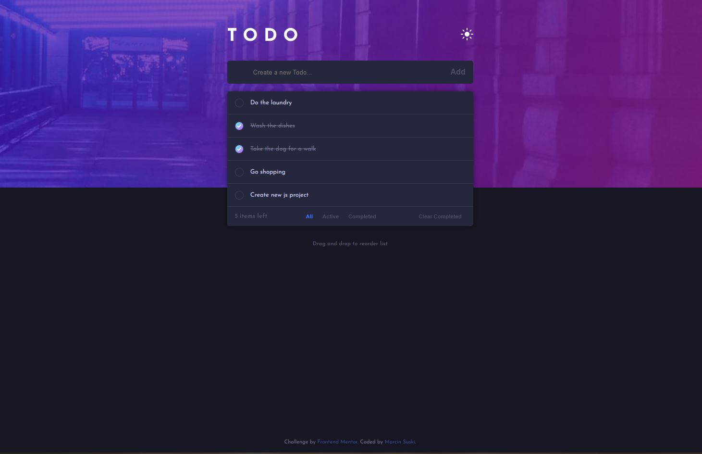

# Frontend Mentor - Todo app solution

This is a solution to the [Todo app challenge on Frontend Mentor](https://www.frontendmentor.io/challenges/todo-app-Su1_KokOW). Frontend Mentor challenges help you improve your coding skills by building realistic projects. 

## Table of contents
- [Overview](#overview)
  - [The challenge](#the-challenge)
  - [Screenshot](#screenshot)
  - [Links](#links)
- [My process](#my-process)
  - [Built with](#built-with)
  - [What I learned](#what-i-learned)
- [Author](#author)

## Overview
I chose this challenge mainyl to learn and practice creating dropdown navigation and burger button for mobile view. 
Project demands more styling and media queries for navigation bar styling (different positions in mobile and pc view). There is also place for some small animations along with the navigation bard.

### The challenge

Users should be able to:

- View the optimal layout for the app depending on their device's screen size
- See hover states for all interactive elements on the page
- Add new todos to the list
- Mark todos as complete
- Delete todos from the list
- Filter by all/active/complete todos
- Clear all completed todos
- Toggle light and dark mode
- **Bonus**: Drag and drop to reorder items on the list

### Screenshot

### Links
- Live Site URL: [Link](https://venerable-paprenjak-9cb4a2.netlify.app/)

## My process

1. I Created a static site with a list of ready to-dos. 
2. I styled everything with SCSS, dark mode only.
3. I added javascript for adding new todos, removed dummy todos from html and ensured javascript is creating the list on its own. 
4. Then I dealt with deleting todos, filtering todos according to status, deleting completed todos with one button and finally updating count of remaining todos.
5. After that I used javascript to toggle dark and light mode with help of css and appropriate styles added to certain html elements.
6. In the end I added drag and drop possibility for the todo items.

### Built with
- HTML
- CSS/SASS
- Vanilla Javascript

### What I learned
I practiced making todo list with vanilla javascript to be able to move the same logic to React. I learned limitations of vanilla javascript and saw potential solutions in React (less code repetition, easier handling of items with object array of todos, cleaner component structure).
 

## Author
- GitHub - [Marcin Suski](https://github.com/marcinsuski)
- Frontend Mentor - [@marcinsuski](https://www.frontendmentor.io/profile/marcinsuski)
